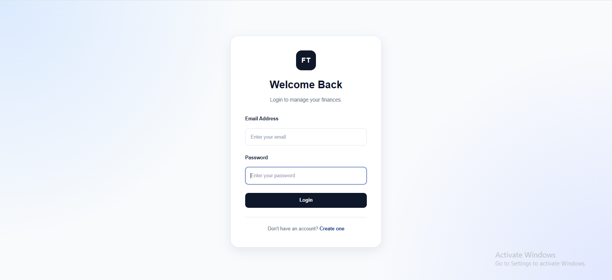
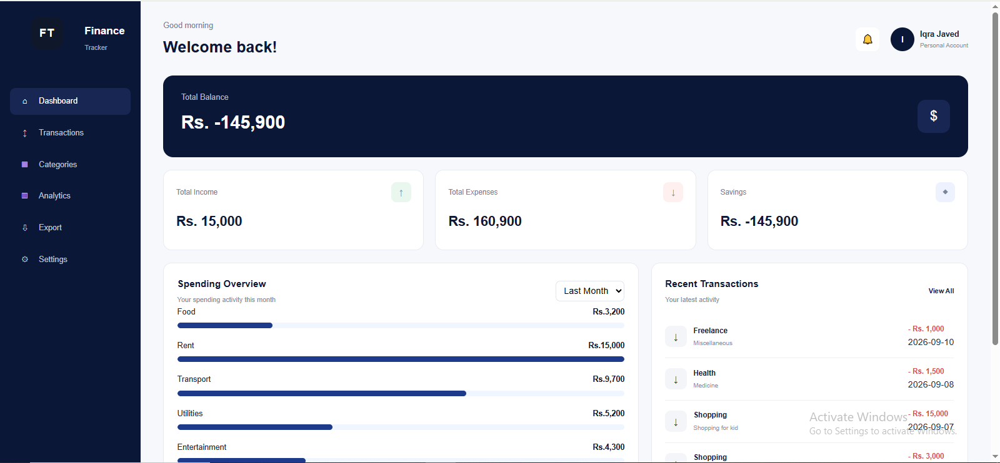
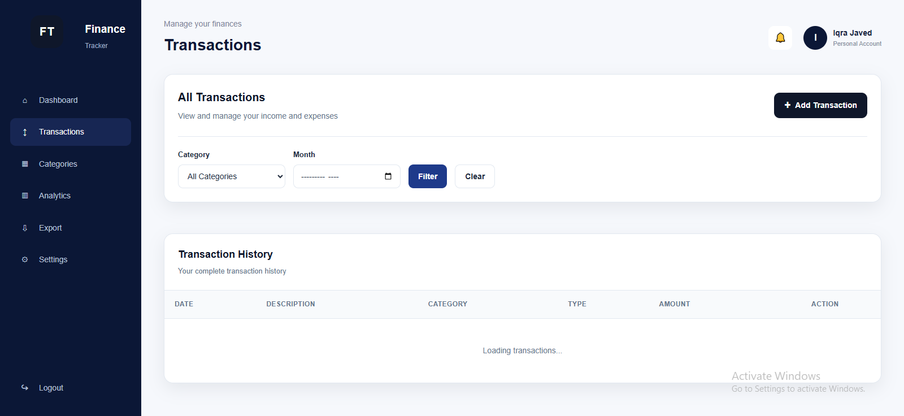
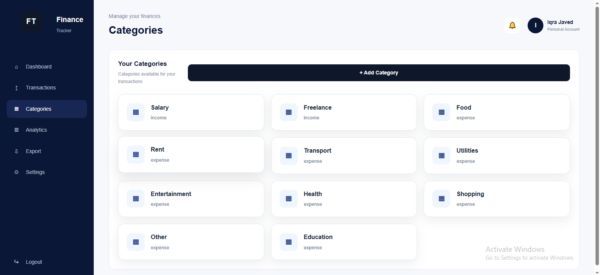
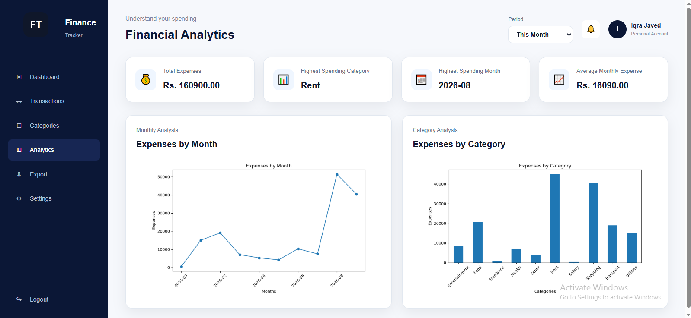
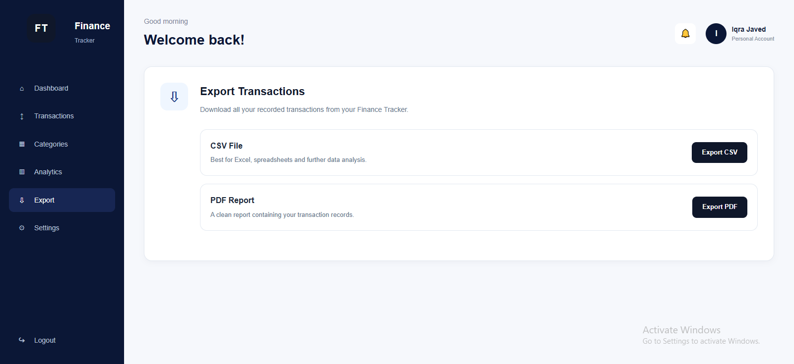
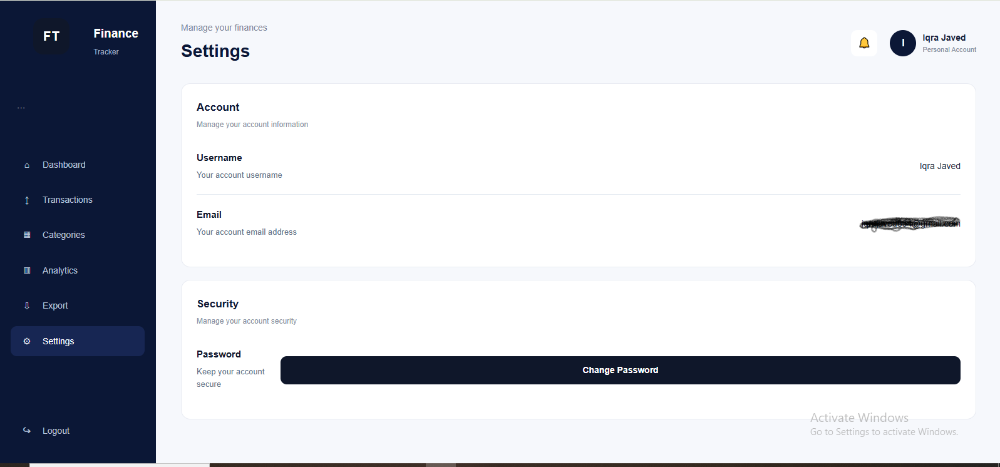

# Personal Finance Tracker

A full-stack personal finance tracking web application built with Flask, MySQL, HTML, CSS, and JavaScript.

The application allows users to manage their income and expenses, organize transactions by category, view financial summaries, analyze spending patterns, and export their financial data.

## Overview

Personal Finance Tracker was developed as a project-based learning application to practice backend development, database management, API development, frontend integration, authentication, data analysis, visualization, and file export.

The application provides a simple interface for managing personal financial records and understanding spending patterns.

## Features

### Authentication

- User signup and login
- Secure password hashing using bcrypt
- Session-based authentication
- Protected routes using a custom `@login_required` decorator
- Logout functionality
- Change password functionality

### Transaction Management

- Add income and expense transactions
- View transaction history
- Edit transactions
- Delete transactions
- Filter transactions by month
- Filter transactions by category
- Transaction validation
- Custom exception handling

### Category Management

- View available categories
- Add custom categories
- Support for income and expense categories
- Assign categories to transactions
- Filter transactions by category

### Dashboard

The dashboard provides a quick overview of the user's finances.

It includes:

- Total income
- Total expenses
- Total balance
- Savings
- Recent transactions
- Spending overview
- Period-based spending information

### Analytics

The analytics section uses SQL, Pandas, Matplotlib, and Seaborn to analyze financial data.

It provides:

- Total expenses
- Highest spending category
- Highest spending month
- Average monthly expenses
- Expenses by month
- Expenses by category
- Monthly spending visualization
- Category spending visualization
- Different spending periods

### Export

Users can export their transaction data in different formats.

- CSV export
- PDF export
- Exception handling during export

### Settings

Users can:

- View account information
- View username and email
- Change their password

## Screenshots

### Login



### Dashboard



### Transactions



### Categories



### Analytics



### Export



### Settings



## Tech Stack

### Backend

- Python
- Flask
- Flask-MySQLdb
- bcrypt
- python-dotenv

### Database

- MySQL

### Data Analysis

- Pandas
- Matplotlib
- Seaborn

### Frontend

- HTML5
- CSS3
- JavaScript
- Fetch API

### Tools

- Git
- GitHub
- Visual Studio Code
- Postman

## Project Structure

```text
finance_tracker/
│
├── app.py
├── config.py
├── requirements.txt
├── .gitignore
├── .env
│
├── models/
│   ├── user.py
│   ├── transaction.py
│   ├── category.py
│   └── budget.py
│
├── routes/
│   ├── auth_routes.py
│   ├── transaction_routes.py
│   ├── category_routes.py
│   ├── analytics_routes.py
│   └── user_routes.py
│
├── analytics/
│   └── analytics.py
│
├── utils/
│   ├── db.py
│   ├── decorators.py
│   └── exceptions.py
│
├── templates/
│   ├── base.html
│   ├── login.html
│   ├── signup.html
│   ├── dashboard.html
│   └── ...
│
├── static/
│   ├── css/
│   │   └── style.css
│   └── js/
│       └── script.js
│
└── screenshots/
    ├── login.png
    ├── dashboard.png
    ├── transactions.png
    ├── categories.png
    ├── analytics.png
    ├── export.png
    └── settings.png
```

## Database

The application uses MySQL with a database named:

```text
finance_tracker
```

The main tables used by the application are:

### Users

Stores user account information.

- User ID
- Username
- Email
- Hashed password

### Transactions

Stores income and expense records.

- Transaction ID
- User ID
- Category ID
- Amount
- Type
- Description
- Transaction date

### Categories

Stores transaction categories.

- Category ID
- User ID
- Category name
- Type

## Analytics Implementation

Financial data is retrieved from MySQL and processed using Pandas.

The analytics module performs operations such as:

- Grouping expenses by category
- Grouping expenses by month
- Calculating total expenses
- Finding the highest spending category
- Finding the highest spending month
- Calculating average monthly expenses

Matplotlib and Seaborn are used to create visualizations for monthly and category-based spending.

The analytics functionality was also extended to support different spending periods.

## API Endpoints

### Authentication

```text
POST /signup
POST /login
POST /logout
```

### Transactions

```text
POST   /transactions
GET    /transactions
PUT    /transactions/<id>
DELETE /transactions/<id>
```

The transaction GET endpoint supports filtering by:

```text
month
category_id
```

### Categories

```text
GET  /categories
POST /categories
```

### User

```text
GET /profile
```

### Analytics

```text
GET /analytics
```

## Testing

The project was tested throughout development using the browser and Postman.

Testing included:

- User signup and login
- Logout functionality
- Authentication protection
- Creating transactions
- Viewing transactions
- Updating transactions
- Deleting transactions
- Category creation
- Category filtering
- Month filtering
- Dashboard functionality
- Analytics calculations
- Different analytics periods
- CSV export
- PDF export
- Exception handling
- Input validation
- Empty-data scenarios
- Responsive UI

## Development Journey

### Day 1 — Project Setup

- Designed the MySQL database schema
- Created the Flask project structure
- Set up the virtual environment
- Configured the application

### Day 2 — Models and Authentication

- Created the user model
- Set up MySQL connection handling
- Implemented password hashing using bcrypt
- Implemented signup, login, and logout
- Created the `@login_required` decorator
- Tested authentication

### Day 3 — Transaction CRUD

- Created transaction and category models
- Implemented transaction CRUD APIs
- Added category APIs
- Added month and category filtering
- Created custom exceptions
- Added exception handling
- Tested APIs using Postman

### Day 4 — Frontend and Dashboard

- Created login and signup pages
- Built the dashboard
- Added HTML and CSS styling
- Connected JavaScript with Flask APIs
- Implemented transaction management through the browser
- Added navigation and authentication flow

### Day 5 — Analytics

- Created SQL analytics queries
- Retrieved financial data from MySQL
- Loaded data into Pandas
- Grouped expenses by category and month
- Calculated financial summary statistics
- Created visualizations using Matplotlib and Seaborn
- Built the analytics page

### Day 6 — Analytics Periods

The original plan included an advanced statistics module.

Instead, the existing analytics functionality was extended to support different spending periods.

Users can select different periods and view the corresponding spending information.

### Day 7 — Export

- Added transaction export functionality
- Implemented CSV export
- Implemented PDF export
- Added exception handling
- Tested export functionality

### Day 8 — Polish and Testing

- Improved the user interface
- Fixed frontend and backend issues
- Added validation and error messages
- Improved responsiveness
- Tested different application scenarios
- Checked edge cases
- Performed final project testing

## How to Run

### 1. Clone the repository

```bash
git clone YOUR_GITHUB_REPOSITORY_URL
```

### 2. Open the project directory

```bash
cd finance_tracker
```

### 3. Create a virtual environment

```bash
python -m venv venv
```

### 4. Activate the virtual environment

Windows:

```bash
venv\Scripts\activate
```

### 5. Install dependencies

```bash
pip install -r requirements.txt
```

### 6. Configure environment variables

Create a `.env` file in the project root.

Example:

```env
MYSQL_HOST=localhost
MYSQL_USER=your_username
MYSQL_PASSWORD=your_password
MYSQL_DB=finance_tracker
SECRET_KEY=your_secret_key
```

Do not commit your `.env` file to GitHub.

### 7. Create the database

Create the MySQL database:

```sql
CREATE DATABASE finance_tracker;
```

Then create the required tables according to the project schema.

### 8. Run the application

```bash
python app.py
```

Open the application in your browser:

```text
http://127.0.0.1:5000
```

## What I Learned

Through this project, I practiced:

- Python and Flask
- Object-oriented programming
- MySQL database design
- SQL queries
- REST-style API development
- Authentication and session management
- Password hashing using bcrypt
- Custom exception handling
- JavaScript DOM manipulation
- Fetch API
- Async JavaScript
- Frontend and backend integration
- Pandas data analysis
- Matplotlib and Seaborn
- CSV and PDF generation
- Git and GitHub
- Postman API testing
- Debugging a full-stack application

## Future Improvements

Possible future improvements include:

- Advanced statistical analysis
- Spending anomaly detection
- Spending prediction
- Budget management
- More detailed financial reports
- Additional financial visualizations
- More advanced financial insights
- Production deployment

## Author

Developed as a full-stack Python project to practice Flask, MySQL, JavaScript, data analysis, visualization, API development, and application development.